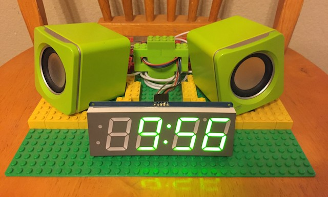
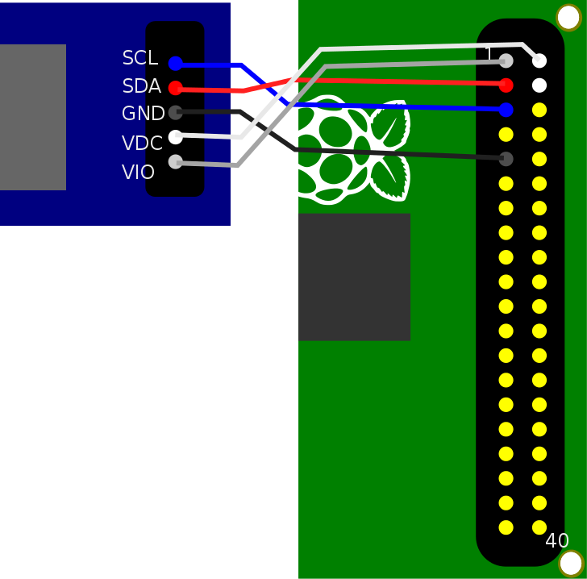

# Pi O'Clock

An alarm clock for the Raspberry Pi.



Deployed on a Raspberry Pi Model B 2011.12 running Raspbian 2015-05-05

## Features

Development is ongoing.

* [x] LED clock display
* [x] Alarms
* [x] Play songs
* [x] Say something random
* [ ] Tell the weather
* [ ] Tell a joke
* [ ] Words of wisdom
* [ ] Pester your children

## Install

On a Raspberry Pi:

```bash
# Disable power saving so Wi-Fi doesn't drop
sudo sh -c 'echo "options 8192cu rtw_power_mgnt=0 rtw_enusbss=1 rtw_ips_mode=1" >> /etc/modprobe.d/8192cu.conf'

sudo apt-get -y update; sudo apt-get -y upgrade
sudo apt-get -y install build-essential python-dev python-pip mpg123 supervisor
sudo dpkg-reconfigure tzdata

# Install i2c for the LED backpack
sudo apt-get -y install i2c-tools libffi-dev
sudo sh -c 'echo "i2c-dev\ni2c-bcm2708" >> /etc/modules'
sudo sh -c 'echo "dtparam=i2c1=on\ndtparam=i2c_arm=on" >> /boot/config.txt'

git clone git@github.com:everett-toews/pi-o-clock.git
sudo cp /home/pi/pi-o-clock/pi-o-clock.conf /etc/supervisor/conf.d/

sudo pip install --upgrade setuptools
sudo pip install --upgrade pip
sudo pip install -r /home/pi/pi-o-clock/requirements.txt

git clone git@github.com:adafruit/Adafruit_Python_LED_Backpack.git
sudo python /home/pi/Adafruit_Python_LED_Backpack/setup.py install

sudo reboot
```

## Configure Say

Setup an account on [VoiceRSS](http://www.voicerss.org/) and get an API key.

```
sudo sh -c 'echo "export VOICERSS_API_KEY=my_voicerss_api_key" >> /root/.profile'
```

## Run

On a Raspberry Pi:

```
ssh -i ~/.ssh/id_rsa.clock pi@raspberry.pi.ip.address
cd pi-o-clock
git pull
sudo supervisorctl restart pi-o-clock
```

### Supervisor

```
service supervisor status

sudo supervisorctl status pi-o-clock
sudo supervisorctl update pi-o-clock
sudo supervisorctl start pi-o-clock
sudo supervisorctl restart pi-o-clock

# on pi-o-clock.conf file changes
sudo supervisorctl reread
sudo supervisorctl update
```

## Develop

On a Mac:

Install [FUSE and SSHFS](https://osxfuse.github.io/)

```
ssh-keygen -t rsa -b 4096 -N '' -f ~/.ssh/id_rsa.clock
mkdir -p ~/dev/sshfs/pi-o-clock
sshfs -o IdentityFile=~/.ssh/id_rsa.clock pi@raspberry.pi.ip.address:pi-o-clock ~/dev/sshfs/pi-o-clock/

cd pi-o-clock
source venv/bin/activate
python -m unittest discover tests
python manage.py runserver --debug

cd ..
sudo umount ~/dev/sshfs/pi-o-clock/
```

## Interactive Shell

On a Raspberry Pi:

```
sudo python manage.py shell

from clock import bg
bg.print_jobs()

from clock import sched
sched.list_alarms()

from clock.sched import Alarm
sched.play_alarm(Alarm('pi-oclock'))
sched.remove_alarm(Alarm('clock-tick'))
```

## Connecting the 7-Segment LED Display

_I picked up these instructions from the [Hack Clock](http://hackclock.deckerego.net/lessons/01_display.html) project._

To wire up the LED display to the Raspberry Pi you need to grab a five jumper wires of varying colors. The actual color doesn't matter at all... however sometimes it is helpful to stick with a color scheme that other engineers often use. By using the same colors each time, you can more easily determine what each wire is supposed to do.



To wire up the Adafruit 7-Segment LED backpack to a Raspberry Pi:

1. Wire the VIO (I/O power) pin on the display to Pin #1 (3.3V power) on the Raspberry Pi using a grey jumper cable
1. Connect the SDA (I2C Data) pin on the display to Pin #3 (SDA) on the Raspberry Pi using a red cable
1. Connect the SCL (I2C Clock) pin on the display to Pin #5 (SCL) on the Raspberry Pi with a blue cable
1. Wire the GND (Ground) pin on the display to Pin #7 (Ground) on the Raspberry Pi using a black jumper cable
1. Connect the VDC (LED power) pin on the display to Pin #2 (5V power) on the Raspberry Pi with a white jumper cable

Once the display is wired up, double-check your connections and power on your Raspberry Pi.
